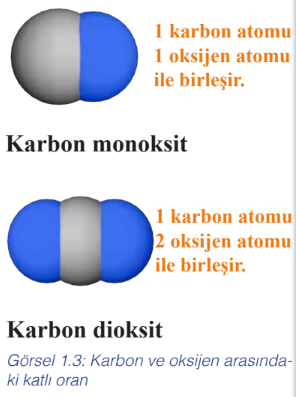
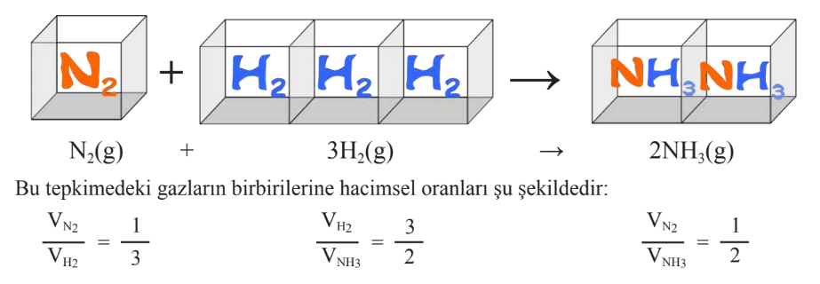

# Kimyanın Temel Kanunları

## Kütlenin Korunumu Kanunu

 Kütlenin korunumu kanunu <b>Antoine Laurent de Lavoisier</b> tarafından ortaya konmuştur. 

> 1774 yılında Lavosier, bir miktar kalay ve hava bulunan cam balonun ağzını kapatarak tartmıştır. Daha sonra kabı ısıtmış ve kalayın beyaz bir toza (SnO) dönüştüğünü görmüştür. Son durumda kabı yeniden tartmış ve **kütlenin değişmediğini** bulmuştur. Lavoiser yaptığı benzer deneyler sonucunda kütlenin korunumu kanununu ifade etmiştir.

_Bir tepkimede tepkimeye giren maddelerin kütleleri toplamı oluşan ürünlerin kütleleri toplamına eşittir_. Bu kanuna `kütlenin korunumu kanunu` denir.

> **Not:** Kütlenin korunumu kanunu nükleer tepkimelerde geçerli değildir.

## Sabit Oranlar Kanunu
Fransız kimyacı <b>Joseph Proust</b>, 1797 yılında birçok bileşiğin bileşimi üzerine yaptığı çeşitli gözlemler sonucu _bir bileşiğin hangi metotla elde edilirse edilsin elementlerin bileşim oranlarının aynı olduğunu_ görmüştür. Yaptığı bu gözlemini `sabit oranlar kanunu` olarak tanımlamıştır.

## Katlı Oranlar Kanunu

Katlı oranlar kanunu 1804 yılında <b>John Dalton</b> tarafından ortaya konulmuştur. Bu kanuna göre <i>iki element birden fazla bileşik oluşturuyor ise bu elementlerden herhangi birinin sabit miktarıyla birleşen diğer elementin kütleleri arasında basit tam sayılarla ifade edilebilen bir oran vardır</i>. Bu orana <code>katlı oran</code> denir. 

> Örneğin karbon ile oksijen elementleri arasında birden fazla bileşik oluşabilir. Bu bileşikler karbon monoksit ve karbon dioksittir. 12 gram karbon elementiyle oluşturulan karbon monoksit bileşiğinde 16 gram oksijen elementi vardır. Aynı miktarda karbon elementiyle oluşturulan karbon dioksit bileşiğinde ise 32 gram oksijen elementi bulunur. O hâlde sabit 12 gram karbon elementi ile birleşen oksijen molekülleri arasında 32/16 = 2/1 oranı vardır. Bu sonuç Dalton Atom Modeli'ne uygundur. Çünkü karbon monoksitte 1 karbon atomuyla 1 oksijen atomu, karbon dioksitte ise 1 karbon atomuyla 2 oksijen atomu birleşir. Karbon dioksitte daima karbon monoksittekinin iki katı kadar oksijen atomu bulunur.
> 
> 

İki bileşik arasında katlı oranlar kanununun aranabilmesi
için gereken koşullar şunlardır:
1. Bileşik çiftinin aynı elementlerden oluşması gerekir. LiCl – NaCl bileşik çiftinde elementler aynı olmadığı için katlı oran yoktur.
2. Bileşik çiftlerindeki element cinsi ikiden fazla olamaz. H2SO4 – H2SO3 ikiden fazla element cinsi içerdiği için bu bileşik çiftinde katlı oran yoktur.
3. Bileşik çiftleri arasındaki katlı oran 1 ise katlı oranlar kanunu bu bileşik çiftlerine de uygulanamaz. C2H4 – C3H6 bileşik çifti arasında katlı oran yoktur.

## Sabit Hacim Oranları Kanunu

 Bu kanuna göre gazlar, belirli basınç ve sıcaklıkta basit hacim oranlarına göre birleşir. Gaz hâlindeki herhangi bir ürünün hacmi ile tepkimeye giren gazlardan herhangi birinin hacmi arasında da tam sayılı basit bir oran vardır. Sabit hacim oranları kanunu, <b>Joseph Gay-Lussac</b> tarafından 1809 yılında ortaya konulmuştur. 

> Bu kanuna göre azot ve hidrojen gazlarının amonyak gazı oluşturmak için gerçekleştirdiği tepkimede yer alan katsayılar ve hacimler arasındaki bağıntı şöyle ifade edilebilir:
>
> 

